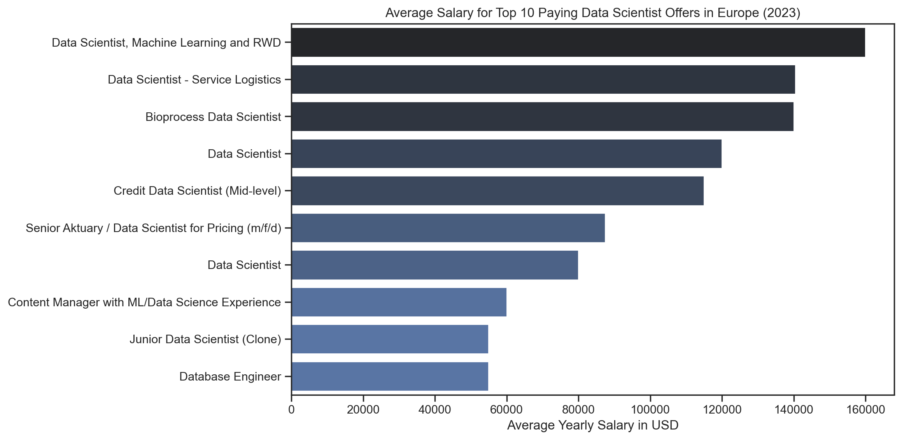
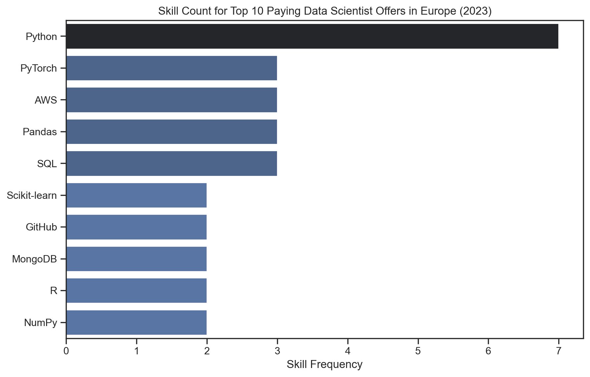
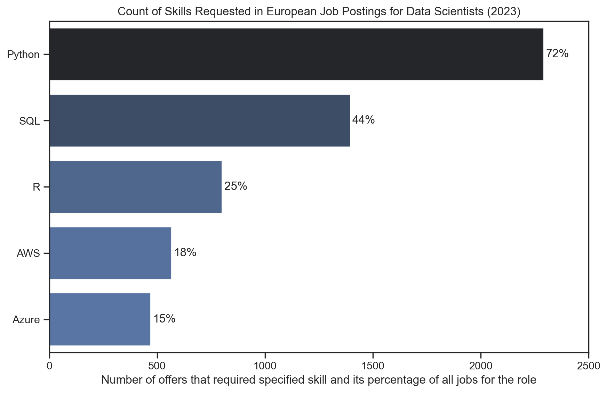

# Introduction

This project is dedicated to exploring the data job market—with a primary focus on the Data Scientist role. Through a detailed analysis of top-paying positions and the skills that drive these lucrative opportunities, the project aims to provide actionable insights for data professionals.

All SQL queries and datasets employed in this analysis can be found in the [sql_code folder](/sql_code/). The underlying data and project inspiration are courtesy of [Luke Barousse](https://lukebarousse.com).

---

# Background

A comprehensive database featuring numerous job postings from 2023 serves as the basis for this project. Each posting includes key information such as location, salary, and required skills. The main objective is to analyze remote job opportunities in Europe for Data Scientist roles. To achieve this, the project addresses the following questions:

1. What are the highest-paying positions for Data Scientists in Europe?
2. Which skills are predominantly associated with these top-paying roles?
3. What skills are most frequently demanded in the field of data science?
4. Which specialized skills command a premium in compensation?
5. What is the optimal skill set for aspiring Data Scientists?

The analysis was conducted using PostgreSQL, Visual Studio Code, Python (with Pyplot), Git, and GitHub.

---

# Data Science Job Offers Analysis
This repository presents an in-depth analysis of the results obtained from SQL queries related to Data Scientist job offers. The analysis covers several key dimensions:

- **Salary Analysis:** A review of salary ranges and descriptive statistics from top-paying offers.
- **Skills Breakdown:** In-depth insights into the skills required for high-paying positions.
- **Demand Assessment:** Analysis of the most in-demand core competencies in data science.
- **Compensation Trade-Offs:** A comparison between frequently requested skills and specialized expertise that yield premium salaries.

---

## 1. Top Paying Offers for Data Scientists
#### What are the highest-paying positions for Data Scientists in Europe?
In this chapter, I explore the landscape of remote opportunities for Data Scientists, focusing on positions with specified average annual salaries. The analysis aims to uncover insights about the upper echelon of salaries within the field, alongside trends in job roles and flexibility.

The findings help highlight the most lucrative positions while showcasing the diversity in employment types, role specifications, and geographical flexibility across Europe.
### SQL Code
The following SQL query was used to extract the data necessary for identifying the highest-paying remote positions for Data Scientists. It filters for job offers with valid salary data, remote work availability, and relevance to the Data Scientist role. The results are sorted by salary to bring the most premium offers to the forefront.
```sql
SELECT 
  job_offer_europe.id AS job_id,
  title,
  location,
  schedule_type,
  salary_year_avg,
  posted_date,
  name AS company_name
FROM job_offer_europe
  LEFT JOIN company ON job_offer_europe.company_id = company.id
WHERE title_short = 'Data Scientist'
  AND work_from_home = TRUE
  AND salary_year_avg IS NOT NULL
ORDER BY salary_year_avg DESC,
  posted_date DESC
LIMIT 10
```
This query retrieves key information such as job titles, locations, employment types, and average salaries while leveraging filtering and sorting to provide clear insights into the top 10 offers.
### Insights

- **Top-Paying Leadership**: The "Data Scientist, Machine Learning and RWD" role at Citeline tops the list with a 160K average salary, proving that mastery in advanced machine learning and related emerging skills attracts premium pay.

- **Niche Specializations Matter**: Roles emphasizing domain-specific expertise—such as the "Data Scientist - Service Logistics" at Cisco and "Bioprocess Data Scientist" at Invert, both around 140K—show that non-traditional data science applications offer lucrative opportunities.

- **Robust Market for Standard Roles**: Even more traditional data scientist positions, like those at Workato and Credora with salaries between 115K and 120K, reinforce the competitive compensation level in remote European markets.

- **Strategic Role Customization**: The diversity in job titles reflects how tailoring data science expertise to specific sectors or operational needs can significantly impact salary benchmarks.


*Visualization: Top 10 Salaries for Remote Data Scientist Positions in Europe (2023)  
(Generated using Python’s Pyplot.)*

---

## 2. Skills for Top Paying Offers
#### Which skills are predominantly associated with these top-paying roles?
Building on the previous analysis of high-paying remote positions for Data Scientists, this section delves into the skillsets that consistently accompany lucrative opportunities. By examining the prevalence of various skills among the top offers, this analysis provides critical insights for professionals seeking to align their capabilities with market demands.
### SQL Code
The following SQL query identifies skills linked to the highest-paying positions. It first selects the top 10 offers based on average salary and then aggregates skill occurrences across those positions to pinpoint the most frequently mentioned technologies.
```sql
WITH top_paying_jobs AS (
  SELECT 
    job_offer_europe.id,
    title,
    salary_year_avg,
    name AS company_name
  FROM job_offer_europe
    LEFT JOIN company ON job_offer_europe.company_id = company.id
  WHERE title_short = 'Data Scientist'
    AND work_from_home = TRUE
    AND salary_year_avg IS NOT NULL
  ORDER BY salary_year_avg DESC
  LIMIT 10
)
SELECT 
  skill_name,
  COUNT(skill_name) AS skill_count
FROM (
    SELECT 
      top_paying_jobs.*,
      skill.skill_name
    FROM top_paying_jobs
      INNER JOIN job_has_skill ON top_paying_jobs.id = job_has_skill.job_id
      INNER JOIN skill ON job_has_skill.skill_id = skill.id
    ORDER BY salary_year_avg DESC
  ) AS top_paying_jobs_skills
GROUP BY skill_name
ORDER BY skill_count DESC
```
This query is designed to highlight key technologies associated with premium salaries in the dataset, offering valuable information for aspiring candidates.

### Insights
Understanding which skills correlate with the highest salaries provides vital guidance for career development. The analysis identifies key trends in skill requirements:

- **Core Technologies:**  
  - Foundational tools such as **Python**, **SQL**, **AWS**, and **Pandas** are consistently required across top offers.
  
- **Advanced Frameworks:**  
  - Specialized technologies—including **TensorFlow**, **Keras**, **PyTorch**, and **Scikit-learn** are frequently associated with premium roles, underscoring the value of advanced machine learning expertise.


*Visualization: Frequency of Specific Skills for Top Paying Job Offers  
(Generated using Python’s Pyplot.)*

---

## 3. Top Demanded Skills for Data Scientist Roles
#### What skills are most frequently demanded in the field of data science?
This section explores the essential skills required for remote Data Scientist roles across Europe. By analyzing job postings, it identifies the most in-demand competencies and their prevalence in the job market. The results provide valuable insight into the key technologies, tools, and platforms that aspiring and current data scientists should prioritize to remain competitive.
### SQL Code
The SQL query below was designed to determine the top skills frequently mentioned in job postings for remote Data Scientist positions. It calculates the demand for each skill, expressed both in absolute numbers and as a percentage of all job offers analyzed.
```sql
WITH skill_demand AS (
  SELECT 
    skill_name,
    COUNT(job_has_skill.job_id) AS demand_count,
    title_short
  FROM job_offer_europe
    INNER JOIN job_has_skill ON job_offer_europe.id = job_has_skill.job_id
    INNER JOIN skill ON job_has_skill.skill_id = skill.id
  WHERE title_short = 'Data Scientist'
    AND work_from_home = TRUE
  GROUP BY skill_name,
    title_short
  ORDER BY demand_count DESC
  LIMIT 5
), total_jobs_per_role AS (
  SELECT 
    title_short,
    COUNT(*) AS total_jobs
  FROM job_offer_europe
  WHERE title_short = 'Data Scientist'
    AND work_from_home = TRUE
  GROUP BY title_short
)
SELECT 
  skill_name,
  demand_count::INTEGER,
  ROUND(
    demand_count::FLOAT / total_jobs_per_role.total_jobs * 100
  ) AS demand_percent
FROM skill_demand
  INNER JOIN total_jobs_per_role ON skill_demand.title_short = total_jobs_per_role.title_short
```
This query aggregates skill demand across job postings and computes their prevalence, providing a clear snapshot of the most sought-after skills.
### Insights
This segment shifts focus to the most frequently requested skills within the dataset, along with their prevalence across job postings:

- **Python:**  
  - Appearing in approximately 72% of offers (2292 occurrences), Python stands out as the cornerstone technology for data science.
  
- **SQL:**  
  - With about 44% of postings (1395 occurrences) requiring SQL, its importance in data management and querying is clearly illustrated.
  
- **R:**  
  - Featured in roughly 25% of the job offers (801 occurrences), R remains a valuable asset for statistical analysis and data visualization.
  
- **Cloud Technologies:**  
  - Cloud platforms, such as **AWS** (18%) and **Azure** (15%), are emerging as secondary, yet increasingly important, skills for data professionals.


*Visualization: Proportional Demand for Key Skills Among Remote Data Scientist Job Offers in Europe (2023)
(Generated using Python’s Pyplot.)*

---

## 4. Top Paying Skills
#### Which specialized skills command a premium in compensation?
This section examines the relationship between specific skillsets and average salaries for remote Data Scientist positions in Europe. By analyzing the dataset, it highlights which specialized skills are linked to the highest levels of compensation, offering valuable guidance for professionals seeking to maximize their earning potential.

### SQL Code
The SQL query below identifies skills associated with higher average salaries. It calculates the mean salary for remote Data Scientist roles that mention each skill and ranks the skills to highlight those commanding a premium in compensation.
```sql
SELECT 
  skill_name,
  ROUND(AVG(salary_year_avg), 0) AS avg_salary
FROM job_offer_europe
  INNER JOIN job_has_skill ON job_offer_europe.id = job_has_skill.job_id
  INNER JOIN skill ON job_has_skill.skill_id = skill.id
WHERE title_short = 'Data Scientist'
  AND salary_year_avg IS NOT NULL
  AND work_from_home = TRUE
GROUP BY skill_name
ORDER BY avg_salary DESC
LIMIT 25
```
This query aggregates salary data for each skill mentioned in job postings and sorts the results to provide insights into premium skills.

### Insights
In this section, the focus is on identifying which specific skills correspond with higher average salaries among remote Data Scientist positions:

- **Premium Skills:**  
  - Skills such as **Redshift**, **Keras**, **PySpark**, and **TensorFlow** are linked with average salaries of around \$160,000.
  - Similarly, expertise in **Scikit-learn**, **NumPy**, and **Pandas** commands high salaries, ranging from approximately \$146,833 to \$150,250.
  
- **Essential but Baseline Skills:**  
  - Although foundational skills like **Python** and **R** appear frequently, they tend to be associated with lower average salaries (\$108,214 and \$101,250 respectively), emphasizing their role as common entry points rather than high-value differentiators.
  
- **Lower-Paid Skills:**  
  - More ubiquitous or less specialized skills, such as **NoSQL** and **Kafka**, are generally linked to lower salary figures, around \$55,000.

The findings suggest that specialized expertise can significantly elevate compensation, whereas foundational skills serve as a necessary baseline.

| Skill Name   | Average Salary ($) | Skill Name | Average Salary ($) |
|--------------|-------------------|-------------|--------------------|
| Redshift     | 160000            | Notion      | 140000            |
| Keras        | 160000            | Slack       | 140000            |
| PySpark      | 160000            | PyTorch     | 126667            |
| TensorFlow   | 160000            | SQL         | 118333            |
| Scikit-learn  | 150250            | GitHub      | 110000            |
| NumPy        | 150000            | Python      | 108214            |
| Pandas       | 146833            | R           | 101250            |
| Oracle       | 140500            | AWS         | 91667             |
| Jupyter      | 140500            | SAS         | 87500             |
| Matplotlib   | 140500            | Java        | 87500             |
| Snowflake    | 140500            | NoSQL       | 55000             |
| Tableau      | 140500            | Kafka       | 55000             |

*Table of the Average Salary for Top Paying Skills Required for Remote Data Scientist Roles. (Europe 2023)*

---

## 5. Best Skills to Acquire for Data Scientists
#### What is the optimal skill set for aspiring Data Scientists?
This chapter combines insights on skill demand and compensation to identify the ideal balance of abilities for career progression. The analysis reveals how specialized expertise can significantly enhance earning potential, while foundational skills serve as essential building blocks for success in the field of data science.

### SQL Code

The following SQL query was crafted to determine the optimal skill set by analyzing both the prevalence of skills and their associated average salaries. It identifies the top skills that strike a balance between demand and premium compensation.
```sql
SELECT
  skill.id,
  skill.skill_name,
  COUNT(job_has_skill.job_id)::INTEGER AS demand_count,
  ROUND(AVG(job_offer_europe.salary_year_avg), 0) AS avg_salary
FROM job_offer_europe
  INNER JOIN job_has_skill ON job_offer_europe.id = job_has_skill.job_id
  INNER JOIN skill ON job_has_skill.skill_id = skill.id
WHERE title_short = 'Data Scientist'
  AND salary_year_avg IS NOT NULL
  AND work_from_home = TRUE
GROUP BY skill.id
HAVING COUNT(job_has_skill.job_id) > 1
ORDER BY avg_salary DESC,
  demand_count DESC
LIMIT 25
```
This query provides a clear overview of which skills offer the best return on investment for aspiring professionals, combining demand frequency with average salary insights.

### Insights

By merging insights on both skill demand and compensation, the analysis identifies an optimal balance of skills for career advancement:

- **Specialized Expertise:**  
  - Skills such as **Scikit-learn** and **NumPy**, though less frequently demanded, are associated with high compensation (approximately \$150,000 on average). This indicates that deep expertise in niche areas offers a clear competitive advantage.
  
- **Core Competencies:**  
  - While foundational skills like **Python** are ubiquitous and essential, their widespread availability also means they offer moderate salary premiums. Complementary skills in **SQL** and **AWS** provide a balanced mix of demand and compensation.


| Skill ID  | Skill    | Demand Count | Average Salary ($) |
|-----|---------------|--------------|-----------:|
| 106 | Scikit-learn  | 2            | 150250     |
| 94  | NumPy         | 2            | 150000     |
| 93  | Pandas        | 3            | 146833     |
| 101 | PyTorch       | 3            | 126667     |
| 0   | SQL           | 3            | 118333     |
| 216 | GitHub        | 2            | 110000     |
| 1   | Python        | 7            | 108214     |
| 5   | R             | 2            | 101250     |
| 76  | AWS           | 3            | 91667      |

*Table: Optimal Skills for Data Scientists Sorted by Average Salary and Demand. (The table summarizes insights from the integrated dataset analysis.)*

---

# What I Learned

Throughout this project, I significantly enhanced my SQL proficiency—especially in constructing complex queries utilizing subqueries and Common Table Expressions (CTEs). I refined my data aggregation techniques using grouping and aggregate functions and deepened my understanding of effective data visualization with Python libraries such as Pyplot and Seaborn.

---

# Conclusions

This project offers a comprehensive examination of the data job market for Data Scientist roles in remote settings across Europe, yielding several key insights:

- **Market Dynamics:**  
  The salary analysis reveals a diverse spectrum—from premium offers reaching \$160,000 to modest entry points around \$55,000. While foundational skills like Python and SQL are non-negotiable for any successful data career, the ability to master advanced frameworks such as TensorFlow and PyTorch positions candidates for top-tier compensation.

- **Skill Demand vs. Compensation:**  
  A critical trade-off becomes evident: the most frequently required skills often provide a strong foundation yet command moderate pay, whereas specialized, niche skills—though less common—can yield substantial salary premiums. This dynamic emphasizes the value of developing both breadth and specialization.

- **Strategic Career Development:**  
  For aspiring Data Scientists, the path to success lies in continuously updating and expanding one’s skill set. Building a robust foundation while progressively investing in advanced, high-impact competencies is essential for achieving long-term career growth and standing out in a competitive market.

- **Data-Driven Decision Making:**  
  The project demonstrates the power of leveraging SQL analytics and visualization tools. By interpreting real-world job market data, professionals can make informed decisions on which skills to prioritize and how to strategically plan their career development.

Overall, these insights underscore that in today’s rapidly evolving data landscape, continuous learning and strategic skill acquisition are indispensable. The findings serve not only as a reflection of current trends but also as a roadmap for navigating and excelling in the competitive field of data science.
